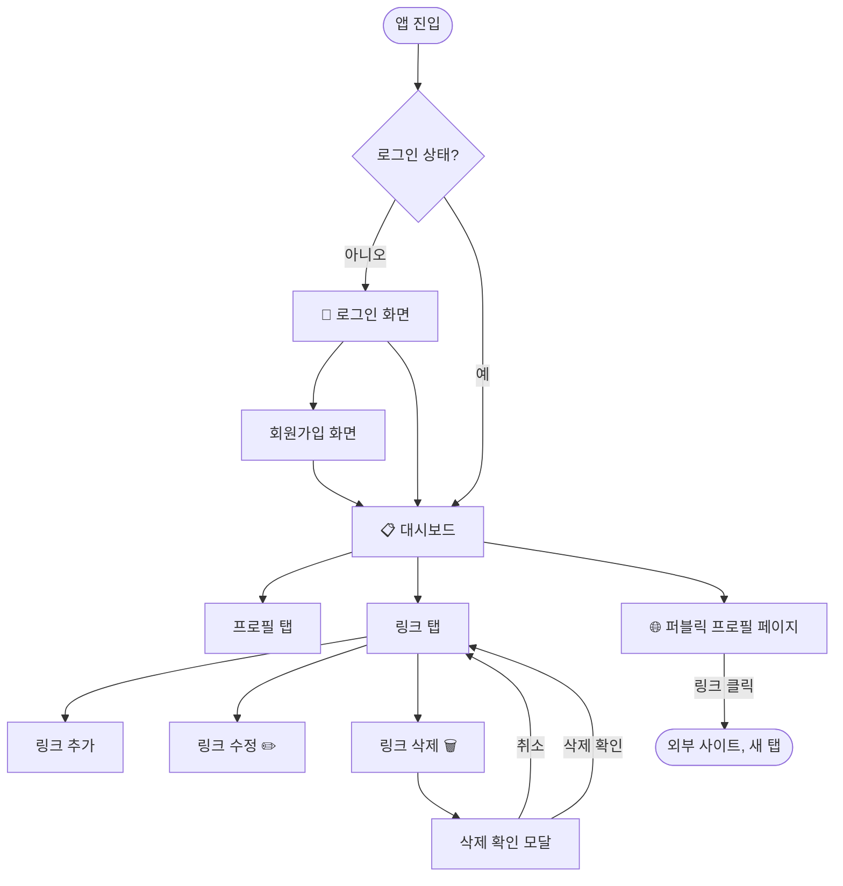

# 마이링크 (MyLink) - 와이어프레임 (Wireframe)

> 모바일 기준 (Mobile-first) / 화면 너비 390px 기준

---

## 1. 페이지 흐름 (Page Flow)



---

## 2. 화면별 와이어프레임

### A. 로그인 화면

```
┌─────────────────────────┐
│                         │
│      🔗 마이링크         │
│                         │
│  ┌───────────────────┐  │
│  │ 이메일             │  │
│  └───────────────────┘  │
│  ┌───────────────────┐  │
│  │ 비밀번호           │  │
│  └───────────────────┘  │
│                         │
│  ┌───────────────────┐  │
│  │      로그인        │  │
│  └───────────────────┘  │
│                         │
│  계정이 없으신가요?       │
│  [회원가입 →]           │
│                         │
└─────────────────────────┘
```

---

### B. 회원가입 화면

```
┌─────────────────────────┐
│                         │
│      🔗 마이링크         │
│                         │
│  ┌───────────────────┐  │
│  │ 이름 (username)    │  │
│  └───────────────────┘  │
│  ┌───────────────────┐  │
│  │ 이메일             │  │  ← displayname 자동 추출
│  └───────────────────┘  │
│  ┌───────────────────┐  │
│  │ 비밀번호           │  │
│  └───────────────────┘  │
│                         │
│  🔗 내 링크 주소 미리보기 │
│  mylink.com/[이메일앞부분] │
│                         │
│  ┌───────────────────┐  │
│  │      회원가입      │  │
│  └───────────────────┘  │
│                         │
│  이미 계정이 있으신가요?  │
│  [로그인 →]             │
│                         │
└─────────────────────────┘
```

---

### C. 대시보드 - 링크 탭 (기본)

```
┌─────────────────────────┐
│  안녕하세요, username 님  │
│  mylink.com/displayname  │  ← 클릭 시 퍼블릭 페이지 이동
├─────────────────────────┤
│   [ 링크 ]   [ 프로필 ] │  ← 탭 메뉴
├─────────────────────────┤
│                         │
│  ┌───────────────────┐  │
│  │ [🌐] 링크 제목 1  ✏️🗑️│  
│  │      url...        │  │
│  └───────────────────┘  │
│                         │
│  ┌───────────────────┐  │
│  │ [🌐] 링크 제목 2  ✏️🗑️│  
│  │      url...        │  │
│  └───────────────────┘  │
│                         │
│  ┌───────────────────┐  │
│  │   + 새 링크 추가   │  │
│  └───────────────────┘  │
│                         │
└─────────────────────────┘
```

---

### D. 대시보드 - 링크 인라인 편집 상태

```
┌─────────────────────────┐
│  안녕하세요, username 님  │
│  mylink.com/displayname  │
├─────────────────────────┤
│   [ 링크 ]   [ 프로필 ] │
├─────────────────────────┤
│                         │
│  ┌───────────────────┐  │
│  │ [🌐] [제목 입력중] │  │  ← ✏️ 클릭 후 인라인 편집 상태
│  │      [URL 입력중]  │  │     Enter 또는 외부 클릭 시 저장
│  │           [저장]   │  │
│  └───────────────────┘  │
│                         │
│  ┌───────────────────┐  │
│  │ [🌐] 링크 제목 2  ✏️🗑️│  
│  │      url...        │  │
│  └───────────────────┘  │
│                         │
└─────────────────────────┘
```

---

### E. 대시보드 - 프로필 탭

```
┌─────────────────────────┐
│  안녕하세요, username 님  │
│  mylink.com/displayname  │
├─────────────────────────┤
│   [ 링크 ]   [ 프로필 ] │
├─────────────────────────┤
│                         │
│  이름 (username)         │
│  ┌───────────────────┐  │
│  │ 홍길동           ✏️│  │
│  └───────────────────┘  │
│                         │
│  닉네임 (displayname)    │
│  ┌───────────────────┐  │
│  │ gildong          ✏️│  │  ← URL 슬러그
│  └───────────────────┘  │
│                         │
│  소개 (Bio)              │
│  ┌───────────────────┐  │
│  │ 한 줄 소개를      ✏️│  │
│  │ 작성해보세요.      │  │
│  └───────────────────┘  │
│                         │
└─────────────────────────┘
```

---

### F. 삭제 확인 모달

```
┌─────────────────────────┐
│  안녕하세요, username 님  │
│  mylink.com/displayname  │
├─────────────────────────┤
│   [ 링크 ]   [ 프로필 ] │
├─────────────────────────┤
│  ╔═══════════════════╗  │
│  ║  🗑️  링크 삭제    ║  │
│  ║                   ║  │
│  ║ '링크 제목 1'을   ║  │
│  ║  삭제하시겠습니까? ║  │
│  ║  삭제 후 복구가   ║  │
│  ║  불가능합니다.    ║  │
│  ║                   ║  │
│  ║  [취소] [삭제]    ║  │
│  ╚═══════════════════╝  │
│                         │
└─────────────────────────┘
```

---

### G. 퍼블릭 프로필 페이지 (방문자 화면)

```
┌─────────────────────────┐
│                         │
│                         │
│       홍길동             │  ← username
│       @gildong          │  ← displayname
│                         │
│  바이브 코딩을 배우고 있는  │  ← Bio
│  대학생입니다.            │
│                         │
│  ─────────────────────  │
│                         │
│  ┌───────────────────┐  │
│  │ [🌐]  GitHub      │  │  ← 파비콘 + 링크 제목 (새 탭 이동)
│  └───────────────────┘  │
│                         │
│  ┌───────────────────┐  │
│  │ [🌐]  블로그      │  │
│  └───────────────────┘  │
│                         │
│  ┌───────────────────────────┐  │
│  │  ▶ [유튜브 임베드 영상]   │  │  ← 미디어 임베드
│  └───────────────────────────┘  │
│                         │
│                         │
│  Powered by MyLink      │  ← 하단 푸터
└─────────────────────────┘
```

---

## 💡 제안하는 추가 개선점 (AI Suggestion)

1. **빈 상태(Empty State) 화면**: 처음 가입한 소유자가 대시보드에 진입했을 때 링크가 하나도 없는 상태를 별도로 디자인하는 것을 제안합니다. (예: "아직 링크가 없어요. 첫 번째 링크를 추가해보세요! +" 같은 안내 문구) 사용자의 초기 진입 경험(Onboarding)에 큰 영향을 미칩니다.
2. **displayname 수정 시 경고**: 프로필 탭에서 닉네임(`displayname`)을 바꾸면 기존에 공유된 URL이 모두 작동하지 않게 됩니다. 수정 시 "닉네임을 변경하면 기존 링크 주소가 바뀝니다. 계속하시겠습니까?"라는 경고 문구를 보여주는 플로우를 추가하는 것을 제안합니다.
